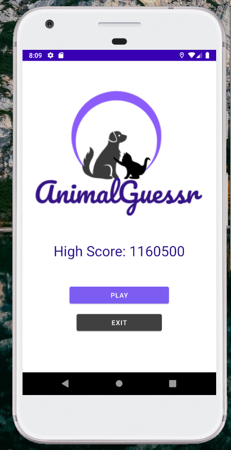
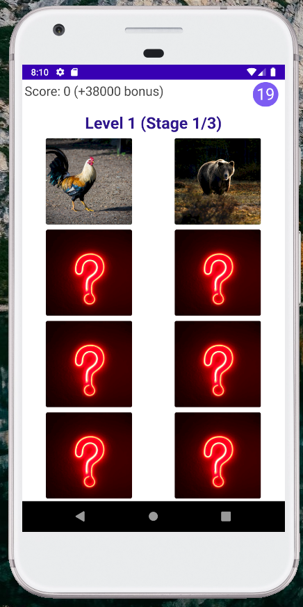
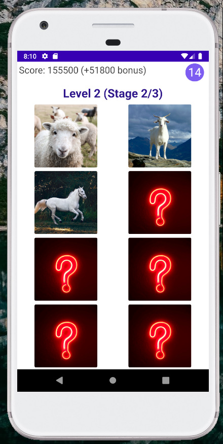
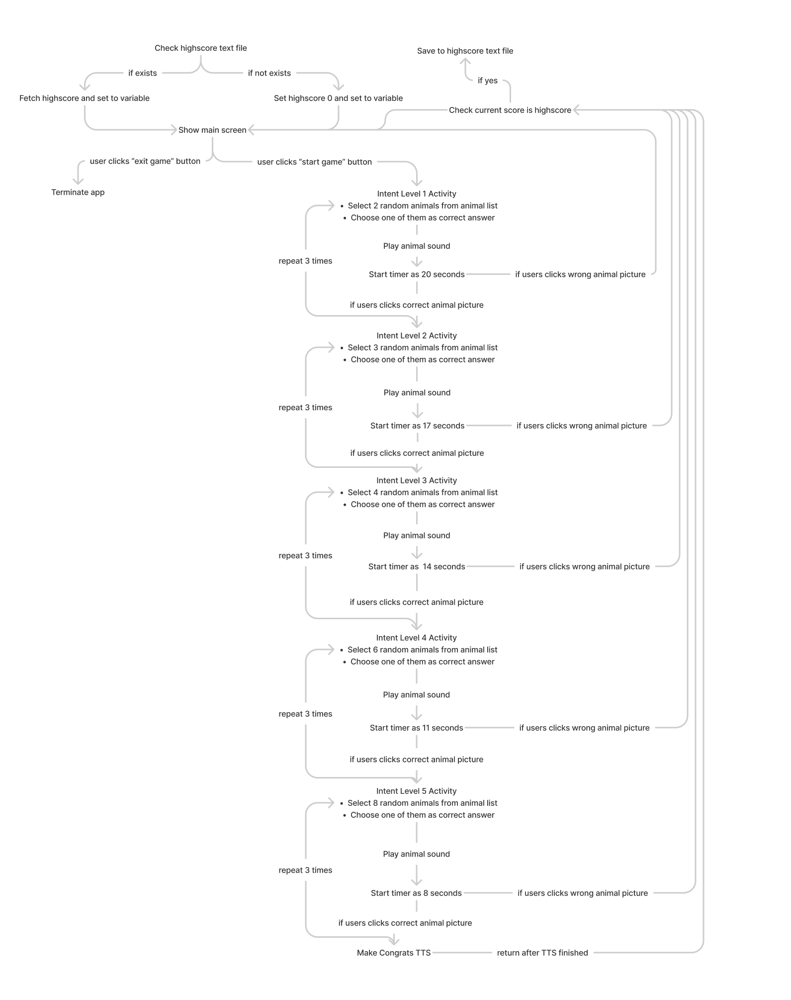
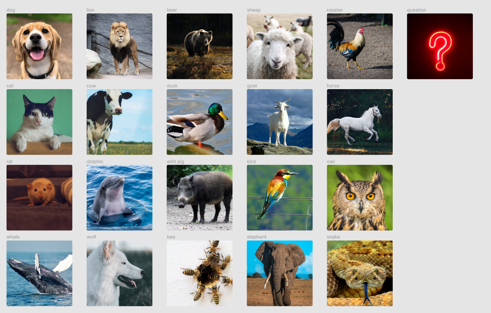

# AnimalGuessr

Animal Finder Game developed for  CENG427 Programming Mobile Devices lecture


### Important Note

```sh
If may encounter issues with TTS Engine try to test it with other Android API Level (minimum 4)
```

### Screenshots

| Screenshot 1  | Screenshot 2  |Screenshot 3 |
| ------------------------------------------------------------  | ------------------------------------------------------------ | | ------------------------------------------------------------ |
|  |    |     | 

<br/>

### Algorithm Schema



### Available Animals



### Photos

All photos are gathered from Unsplash, if you know the photos that I use have copyright please let me know that by opening an issue.


### Contributing

Pull requests are welcome. For major changes, please open an issue first to discuss what you would like to change.
